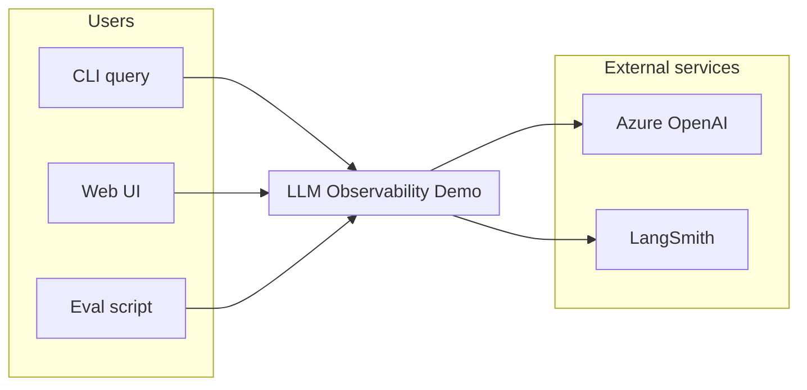
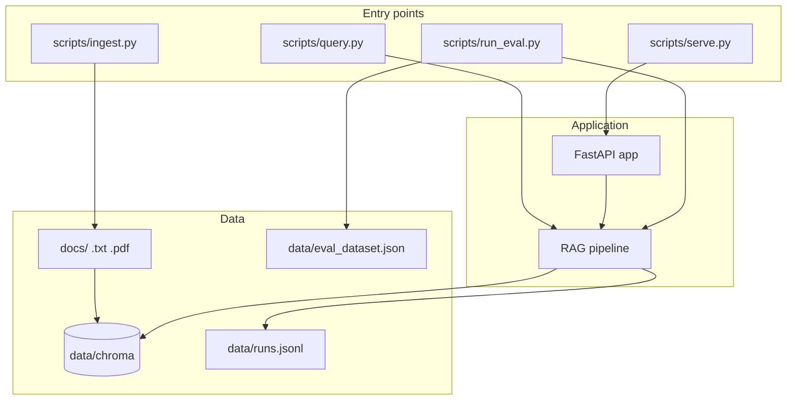
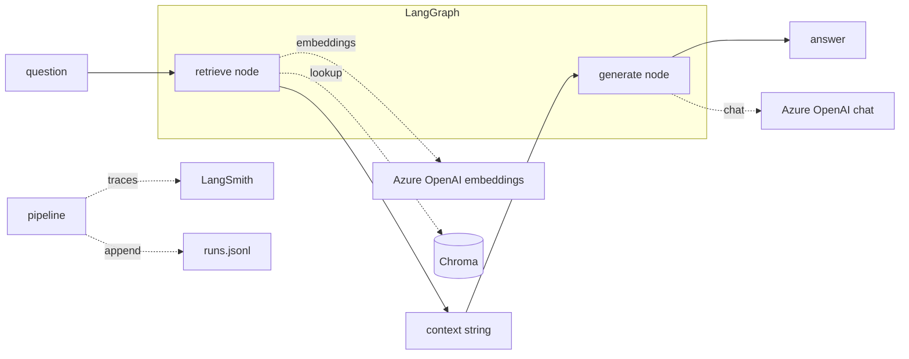

# LLM Observability & Evaluation Demo

RAG Q&A pipeline with LangGraph, Azure OpenAI, observability (LangSmith), evaluation, and prompt monitoring.

**GitHub repo description (paste in Settings > General > Description):** see [GITHUB_DESCRIPTION.txt](./GITHUB_DESCRIPTION.txt).

This project demonstrates (1) LLM observability via LangSmith tracing, (2) evaluation on a small Q&A dataset with correctness/similarity metrics, and (3) prompt monitoring with versioned prompts and per-run logs (latency, tokens) for quality tracking.

**Tech stack:** Python 3.11+, LangChain, LangGraph, Azure OpenAI, LangSmith.

---

## Purpose and Product Context

- **Primary use case:** Document Q&A over a small doc set. A user asks questions; a RAG pipeline (LangChain + LangGraph) calls Azure OpenAI, logs every run (observability), scores answers (evaluation), and tracks prompt versions and quality (prompt monitoring).
- **Target users:** Engineers evaluating RAG, observability, and evals in one place.
- **Problem it solves:** Single reference implementation for RAG + tracing + eval + prompt versioning without production-scale complexity.
- **Key value proposition:** Run ingest once, query via CLI or Web UI, run evals and inspect traces and run logs in one repo.

---

## Architecture Overview

- **Core components:** (1) **Ingest** loads docs from `docs/`, chunks and embeds with Azure OpenAI, persists to Chroma in `data/chroma`. (2) **RAG pipeline** (LangGraph) retrieves top-k chunks, builds context, calls Azure OpenAI chat, returns answer; **pipeline** module exposes a runnable and logs each run to `data/runs.jsonl`. (3) **Observability** configures LangSmith (or optional OTLP) so chains and LLM calls are traced. (4) **Eval** runs a fixed Q&A set through the pipeline and scores with a simple correctness metric.
- **Data ownership:** Docs live in `docs/`; Chroma owns vector state in `data/chroma`; `data/runs.jsonl` is append-only run log; `data/eval_dataset.json` is read-only eval set.
- **Technology stack:** Python 3.11+, LangChain, LangGraph, LangSmith, Azure OpenAI (chat + embeddings), Chroma, FastAPI for the Web UI.
- **Key design decisions:** Two-node graph (retrieve then generate) to keep the flow explicit; versioned prompt in one module for monitoring; JSONL for run logs to allow later comparison by prompt version.

See **Architecture wireframe (drill-down)** below for a visual drill-down.

---

## Architecture wireframe (drill-down)

**Level 0 – System context**



**Level 1 – Main components and data flow**



**Level 2 – RAG pipeline (retrieve -> generate)**



**Level 3 – Module map**

| Layer        | Module         | Responsibility                                      |
|-------------|----------------|-----------------------------------------------------|
| Entry       | `scripts/ingest.py` | Load docs, chunk, embed, persist Chroma.            |
| Entry       | `scripts/query.py`  | Single question via pipeline, print answer.         |
| Entry       | `scripts/serve.py`  | Run FastAPI app (Web UI).                          |
| Entry       | `scripts/run_eval.py` | Run eval set, score, print summary.                |
| App         | `src/app.py`   | FastAPI routes: `/`, `POST /query`, `/health`.      |
| App         | `src/pipeline.py` | RAGPipeline: get/store, run graph, log run to JSONL. |
| Core        | `src/graph.py` | LangGraph: retrieve node, generate node.           |
| Core        | `src/retriever.py` | Load docs, chunk, embed, Chroma build/load.       |
| Core        | `src/prompts.py` | Versioned RAG template (PROMPT_VERSION).          |
| Cross-cutting | `src/config.py` | Env-based config (Azure, LangSmith, paths).       |
| Cross-cutting | `src/observability.py` | Configure LangSmith or optional OTLP.          |

---

## Key Workflows

1. **Ingest (one-time or when docs change):** Run `scripts/ingest.py`. Loads `.txt`/`.pdf` from `docs/`, splits into chunks, embeds via Azure OpenAI, writes Chroma to `data/chroma`. No ongoing process.
2. **Query (CLI):** Run `scripts/query.py "Your question"`. Pipeline loads Chroma (or builds from docs if missing), runs LangGraph (retrieve then generate), prints answer and chunk IDs, appends run to `data/runs.jsonl`. Traces go to LangSmith if enabled.
3. **Query (Web UI):** Run `scripts/serve.py`, open http://127.0.0.1:8000. Submit a question in the form; same pipeline as CLI; response shows answer, chunk previews, latency, token estimates.
4. **Eval:** Run `scripts/run_eval.py`. Reads `data/eval_dataset.json`, runs each question through the pipeline, scores (exact-match style), prints per-row score and summary (average, pass rate).

---

## Setup Instructions

1. **Prerequisites:** Python 3.11+, pip.
2. **Install:** From repo root run `pip install -r requirements.txt`.
3. **Initial configuration:** Copy `.env.example` to `.env`. Set Azure OpenAI endpoint and API key and deployment names (chat and embedding). Optionally set LangSmith API key and `LANGCHAIN_TRACING_V2=true` and `LANGCHAIN_PROJECT=llm-observability-demo`.
4. **Ingest:** Run `python scripts/ingest.py` so `data/chroma` is populated (requires at least one `.txt` or `.pdf` in `docs/`).
5. **Verification:** Run `python scripts/query.py "What does this project demonstrate?"` and confirm an answer is printed. Open http://127.0.0.1:8000 after `python scripts/serve.py` and submit a question to confirm the Web UI responds.

---

## Configuration

| Variable | Purpose |
|----------|---------|
| `AZURE_OPENAI_ENDPOINT` | Azure OpenAI endpoint URL (required) |
| `AZURE_OPENAI_API_KEY` | Azure OpenAI API key (required) |
| `AZURE_OPENAI_DEPLOYMENT_CHAT` | Chat model deployment (e.g. `gpt-4o`) |
| `AZURE_OPENAI_DEPLOYMENT_EMBEDDING` | Embedding model deployment (e.g. `text-embedding-3-small`) |
| `LANGCHAIN_API_KEY` | LangSmith API key for tracing (free tier) |
| `LANGCHAIN_TRACING_V2` | Set to `true` to enable tracing |
| `LANGCHAIN_PROJECT` | LangSmith project name (e.g. `llm-observability-demo`) |
| `APPLICATIONINSIGHTS_CONNECTION_STRING` | Optional; use if you add Azure Application Insights telemetry |

See `.env.example` for placeholders and a full list.

---

## Running the Demo

After setup and ingest:

```bash
# One query (CLI)
python scripts/query.py "What does this project demonstrate?"

# Web UI
python scripts/serve.py
# Open http://127.0.0.1:8000

# Evaluation
python scripts/run_eval.py
```

---

## Deploy (live demo)

- **Render:** Connect this repo to [Render](https://render.com). Use the `render.yaml` blueprint or create a Web Service: build `pip install -r requirements.txt`, start `uvicorn src.app:app --host 0.0.0.0 --port $PORT`. Set env vars from `.env.example` in the dashboard. Ensure the vector store exists (run ingest once via one-off job or boot logic).
- **Vercel:** Best for static/Next.js. This app is FastAPI + Chroma; deploy the API to Render or Railway for a live demo link.

---

## Failure Modes

- **No docs in `docs/`:** Ingest fails with a clear error. Add at least one `.txt` or `.pdf` (e.g. `docs/sample.txt`).
- **Missing or invalid .env:** Query, eval, and Web UI fail when calling Azure OpenAI. Fix by setting `AZURE_OPENAI_ENDPOINT` and `AZURE_OPENAI_API_KEY` (and deployments). LangSmith is optional; if key is wrong, tracing fails but RAG still runs.
- **Chroma not built:** If you run query or eval before ingest, the pipeline attempts to build the store from `docs/`. If `docs/` is empty, that build fails.
- **Port 8000 in use:** `scripts/serve.py` fails to bind. Use another port or stop the process using 8000.

---

## Debugging Tips

- **Traces:** Set `LANGCHAIN_TRACING_V2=true` and open the LangSmith project to see trace IDs, latency, and token usage per run.
- **Run log:** Inspect `data/runs.jsonl` for prompt version, question, chunk IDs, latency, and token estimates per run.
- **Eval:** Scores are printed per row and summarized at the end. Edit `data/eval_dataset.json` to add or change question/expected pairs.
- **Web UI errors:** Errors from the pipeline are shown on the same page below the form; check the server console for stack traces.

---

## Screenshots

### Web UI – Question form


### Web UI – Result (answer and chunks)


---

## Explicit Non-Goals

- Production-scale vector DB or distributed ingestion.
- Azure Application Insights or OpenTelemetry in the main path (optional OTLP is env-based).
- LangSmith eval helpers in the default eval script (minimal scorer only; you can wire evaluators separately).
- Multi-tenant or authenticated API.

---

## Known Debt

- Token counts are character-based estimates (e.g. char/4); for real usage rely on LangSmith or API response metadata.
- Eval uses a simple exact-match style check; semantic similarity or LLM-as-judge can be added.
- Chroma is local filesystem; for deploy, consider running ingest at build or first request, or a persistent volume.

---

## CV bullet

Built a RAG pipeline with LangGraph and Azure OpenAI, with LangSmith observability, LLM evaluation on a Q&A dataset, and versioned prompt monitoring.
